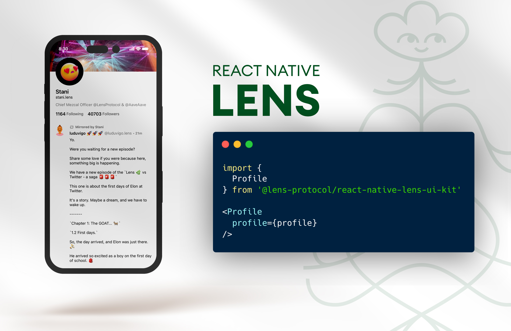

# React Native Lens (alpha)



A React Native UI kit for Lens Protocol.

## Getting started

### Prerequisites

First, install and configure React Native [SVG](https://github.com/software-mansion/react-native-svg).

### Installation

```sh
npm install react-native-lens
```

# Components

## Feed

A feed of posts from Lens.

```javascript
import { Feed } from 'react-native-lens'

// Render a feed of posts
<Feed />
```

### Default props

```
query = {
  name: "explorePublications",
  publicationTypes: ["POST", "COMMENT", "MIRROR"],
  sortCriteria: "LATEST",
  limit: 25
}
ListHeaderComponent = null
ListFooterComponent = null
feed = null
signedInUser = null
onCollectPress = () => {}
onCommentPress = () => {}
onMirrorPress= () => {}
onLikePress = () => {}
hideLikes = false
hideComments = false
hideMirrors = false
hideCollects = false
infiniteScroll = true
onEndReachedThreshold = .6
onProfileImagePress
```

## Profiles

A list of profiles

```javascript
import { Profiles } from 'react-native-lens'

// Render a list of profiles
<Profiles />
```

### Default Props

```
onFollowPress = () => null
onProfilePress = () => null
isFollowing = null
profileData = null
onEndReachedThreshold = .7
infiniteScroll = true
query = {
  name: 'exploreProfiles',
  sortCriteria: 'MOST_FOLLOWERS',
  limit: 25
}
```

## Profile

Renders an individual profile

```javascript
import { Profile } from 'react-native-lens'

// Render an individual profile
<Profile
  profile={profile}
/>
```

### Default props

```
profile (required)
ListHeaderComponent = null
ListFooterComponent = null
feed = null
signedInUser = null
onCollectPress = () => {}
onCommentPress = () => {}
onMirrorPress= () => {}
onLikePress = () => {}
hideLikes = false
hideComments = false
hideMirrors = false
hideCollects = false
infiniteScroll = true
onEndReachedThreshold = .7
onFollowingPress = null
onFollowersPress = null
query = null
onProfileImagePress
```

## Profile Header

Renders a profile header component.

```javascript
import { ProfileHeader } from 'react-native-lens'

// Render a profile headers
<ProfileHeader
  profile={profile}
  // or profileId={profileId}
/>
```

### Default props

```
profileId = null
profile: user = null
onFollowingPress = null
onFollowersPress = null
```

## Publication

Renders an individual publication.

```javascript
import { Publication } from 'react-native-lens'

// Render an individual publication
<Publication
  publication={publication}
/>
```

### Default props

```
publication (required)
signedInUser = null
onCollectPress = () => {}
onCommentPress = () => {}
onMirrorPress= () => {}
onLikePress = () => {}
hideLikes = false
hideComments = false
hideMirrors = false
hideCollects = false
onProfileImagePress = () => {}
```

## ProfileListItem

Renders a list item for a profile overview.

```javascript
import { ProfileListItem } from 'react-native-lens'

// Render a feed of posts
<ProfileListItem
  profile={profile}
/>
```

### Default props

```
profile (required)
onProfilePress
onFollowPress
isFollowing
```